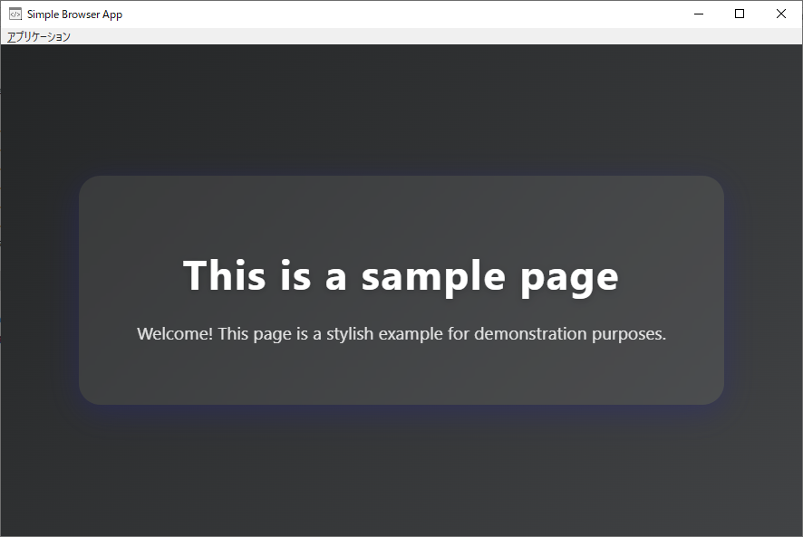

# Simple Browser App
A customizable WPF desktop application featuring a built-in browser (WebView2) and flexible UI/behavior controlled by a JSON configuration file.

## Features
- Displays a local HTML file or a web page (http/https URL) in a browser view (WebView2).
- Application window title, size, menu visibility, "Always on Top" state, and window icon are configurable via JSON.
- The HTML file or URL to display can be specified in the config file (relative path, absolute path, or URL).
- The window icon can be specified as a `.ico` file (full path or relative to the executable); if omitted or invalid, the default executable icon is used.
- Menu includes:
  - "Always on Top" (checkable)
  - "Exit"
- Optionally displays a read-only address viewer above the browser, controlled by the `use_address_viewer` config option.
- All settings are loaded at startup from a config file named `[ExecutableName]-config.json` placed in the same directory as the executable.

## Configuration File (`[ExecutableName]-config.json`)
The application reads its settings from a JSON file named after the executable (e.g., `SimpleBrowserApp-config.json`).  
All properties are optional; defaults are used if not specified.

| Property      | Type    | Description                                                                                                   | Default      |
|---------------|---------|---------------------------------------------------------------------------------------------------------------|--------------|
| title         | string  | Window title.                                                                                                 | null (uses default window title) |
| topmost       | bool    | Whether the window stays always on top.                                                                       | false        |
| menu          | bool    | Whether the application menu is visible.                                                                      | false        |
| window_width  | number  | Window width in pixels.                                                                                       | 300          |
| window_height | number  | Window height in pixels.                                                                                      | 300          |
| html_path     | string  | Path or URL to display in the browser. Supports:<br> - Relative path from executable<br> - Absolute file path<br> - http/https URL | "app.html"   |
| window_icon   | string  | Path to a `.ico` file to use as the window icon.<br>Supports absolute path or path relative to the executable.<br>If omitted, invalid, or not found, the default executable icon is used.<br>**Must be `.ico` extension.** | null         |
| window_state_autosave | bool | Whether to automatically save and restore the window's position, size, and state (maximized/normal) on close and next launch. | true |
| use_page_title | bool | If true, the window title will follow the currently displayed page's title in the browser view (WebView2). If false, the title is fixed as specified by the `title` property or default. | false |
| use_browser_context_menu | bool | If true, the standard WebView2 context menu (right-click menu) is enabled. If false, the context menu is disabled. | true |
| use_address_viewer | bool | If true, displays a read-only address viewer textbox above the browser showing the current page URL. If false or omitted, the address viewer is hidden. | false |

### Example `SimpleBrowserApp-config.json`
```json
{
  "title": "My Custom Browser",
  "topmost": true,
  "menu": true,
  "window_width": 900,
  "window_height": 600,
  "html_path": "app.html",
  "window_icon": "appicon.ico",
  "use_address_viewer": true
}
```
#### Example with use_browser_context_menu disabled
```json
{
  "use_browser_context_menu": false
}
```

#### Example with use_page_title enabled
```json
{
  "use_page_title": true
}
```

#### Example with window_state_autosave disabled
```json
{
  "window_state_autosave": false
}
```

#### Example for absolute path
```json
{
  "html_path": "C:/Users/YourName/Documents/sample.html"
}
```
#### Example for web URL
```json
{
  "html_path": "https://example.com"
}
```
#### Example with use_address_viewer enabled
```json
{
  "use_address_viewer": true
}
```

## How It Works

### `use_browser_context_menu` property details
- **Type:** bool (optional)
- **Default:** true
- **Behavior:**
  - If `true` or omitted, the standard WebView2 context menu (right-click menu) is enabled.
  - If `false`, right-clicking in the browser view will not show the context menu.

### `use_page_title` property details
- **Type:** bool (optional)
- **Default:** false
- **Behavior:**
  - If `true`, the window title will always reflect the title of the currently displayed page in the browser view (WebView2).
  - The window title will update automatically if the page title changes (e.g., via JavaScript or navigation).
  - If `false` or omitted, the window title is fixed as specified by the `title` property or the default.

### `window_state_autosave` property details
- **Type:** bool (optional)
- **Default:** true
- **Behavior:**
  - If `true` or omitted, the app will automatically save the window's position, size, and state (maximized/normal) on close, and restore them on next launch.
  - If `false`, the window will always open with the size and position specified by `window_width`/`window_height` (or defaults), and will not remember its last state.

- On startup, the app loads `[ExecutableName]-config.json` from the executable's directory.
- All settings are applied immediately:
  - Window title, size, "Always on Top" state, and window icon.
  - Menu visibility and "Always on Top" menu check state.
  - The specified HTML file or URL is loaded into the browser view.
    - If `html_path` starts with `http://` or `https://`, it is loaded as a web page.
    - If `html_path` is an absolute path, that file is loaded.
    - Otherwise, it is treated as a relative path from the executable directory.
  - If `window_icon` is specified and points to an existing `.ico` file (absolute or relative to the executable), that icon is used for the window. If omitted, invalid, or not found, the default executable icon is used.
- If a property is missing, the default value (see table above) is used.

### `window_icon` property details
- **Type:** string (optional)
- **Format:** Path to a `.ico` file. Can be an absolute path or a path relative to the executable.
- **Behavior:**
  - If `window_icon` is `null`, omitted, or not a valid `.ico` file, the default executable icon is used.
  - If the file does not exist or the extension is not `.ico`, the default icon is used.
  - If a valid `.ico` file is specified, it is used as the window icon.

### `use_address_viewer` property details
- **Type:** bool (optional)
- **Default:** false
- **Behavior:**
  - If `true`, a read-only address viewer textbox is displayed above the browser, always showing the current page URL.
  - If `false` or omitted, the address viewer is hidden.
  - The address is always updated internally, regardless of visibility.

## Requirements
- .NET 8.0 or later
- [Microsoft.Web.WebView2](https://www.nuget.org/packages/Microsoft.Web.WebView2/) NuGet package

## Build & Run

1. Restore NuGet packages.
2. Build the solution.
3. Place your HTML file (e.g., `app.html`) and the config file in the same directory as the executable, or specify an absolute path or URL in the config.
4. Run the application.

## License
This project is licensed under the MIT License.  
See the [LICENSE](./LICENSE) file for details.
